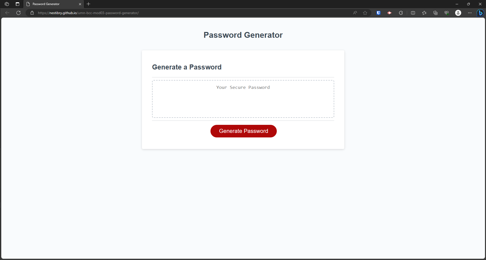
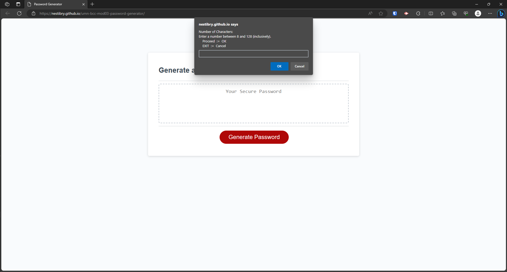
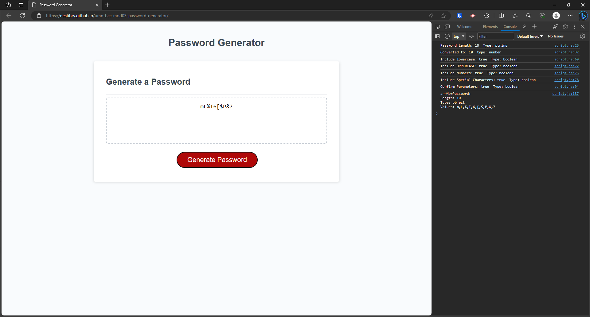

# Module 3 Challenge - Password Generator
*University of Minnesota - Coding Boot Camp*

## Description

Developed a JavaScript codebase to create an application that enables users to generate random passwords based on criteria they have selected. 

- This app runs in the browser and features dynamically updated HTML and CSS powered by JavaScript code. 
- Users can choose a length of at least 8 characters and no more than 128 characters.
- Users can confirm whether or not to include lowercase, uppercase, numeric, and/or [special characters](https://www.owasp.org/index.php/Password_special_characters).

## JavaScript Breakdown (./assets/js/script.js)

1. Event Listener 'generateBtn' waits for user to click "Generate Password" button
2. User click "Generate Password" button intiating the writePassword() function
3. writePassword() calls the generatePassword() function
4. generatePassword() calls the userPrompts() function
5. userPrompts() asks user for password length and types of characters to include (lowercase, uppercase, numbers, special characters)
    - userPrompts() includes cases to exit the generation process
    - userPrompts() returns to generatePassword() to complete the process
6. generatePassword() ensures that at least one character from each character type is included 
7. generatePassword() then combines all possible characters and randomly picks the remaining characters from this array
8. The new password array gets shuffled to eliminate the first characters from having the same type pattern
9. The new password array is transformed into a string and is displayed on the screen.

## Installation

N/A

## Usage

Deployed Site: https://nestibry.github.io/umn-bcc-mod03-password-generator/

Figure: Default Screen

Figure: Prompt Example

 
Figure: Generated Password Example with Console Log

## Credits
[List of password special characters](https://www.owasp.org/index.php/Password_special_characters) from the OWASP Foundation.

[How To Randomly Shuffle a JavaScript Array - Durstenfeld Shuffle](https://stackoverflow.com/questions/2450954/how-to-randomize-shuffle-a-javascript-array) -  (Source Stack Overflow - See post by Laurens Holst and edited by ashleedawg)

© 2023 edX Boot Camps LLC.

## License

[MIT License](https://choosealicense.com/licenses/mit/)

